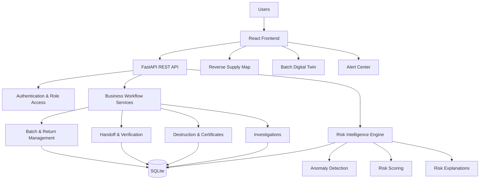

# 💊 PharmaCare

### Track the Batch. Verify the Chain. Detect the Fraud.

> **A closed-loop pharmaceutical reverse-chain compliance and fraud-intelligence platform built for Megathon 2026 — PS-03.**

PharmaCare operationalizes the pharmaceutical reverse-disposal workflow by creating a **batch-level digital trail** for expired and unused medicines — from retail return initiation to distributor verification, manufacturer receipt, destruction evidence, and post-disposal re-entry detection.

---

## 🏆 Megathon 2026 — PS-03

### Pharma Reverse Chain Compliance Platform for Drug Disposal

Expired and unused medicines must leave the active pharmaceutical supply chain through a controlled reverse process.

The challenge is not simply identifying expired medicines.

> **What happens to the batch after it leaves the pharmacy?**

PharmaCare connects the reverse chain:

```text
Retailer
   ↓
Distributor
   ↓
Manufacturer
   ↓
Verified Disposal
   ↓
Compliance Closure
````

while continuously looking for anomalies such as:

* 🔍 Quantity discrepancies
* 📍 Custody inconsistencies
* ⏱️ Timeline anomalies
* 🚨 Re-entry of returned/disposed batches
* 📄 Certificate inconsistencies
* 🧠 Multi-factor suspicious patterns

---

# 🎯 The Problem

Traditional pharmaceutical return processes can become fragmented across retailers, distributors, manufacturers, and regulators.

This creates risks such as:

* Returned stock disappearing between handoffs
* Declared quantities differing from received quantities
* Incomplete disposal evidence
* Expired or returned batches appearing again in retail billing
* Regulators having to reconstruct events manually
* Suspicious custody patterns remaining hidden across multiple organizations

PharmaCare addresses this through a **shared batch-level lifecycle and evidence trail**.

---

# 💡 Our Solution

PharmaCare is a **multi-role reverse-chain compliance platform** that records important events throughout a medicine batch's lifecycle.

### Core Reverse Chain

```text
🏪 Retailer
   │
   │ Return Request
   ▼
🚚 Distributor
   │
   │ Quantity Verification
   ▼
🏭 Manufacturer
   │
   │ Destruction + Certificate
   ▼
♻️ Verified Disposal
   │
   │
   ▼
🚨 Re-entry Monitoring
```

The platform does not stop at recording status changes.

It asks:

> **"Does this batch's journey make sense?"**

---

# 🚀 What Makes PharmaCare Different?

The basic reverse-chain workflow is part of the problem statement.

Our primary differentiation is the:

## 🧠 Pharma Reverse Chain Risk Intelligence Layer

Instead of treating every event independently, PharmaCare correlates multiple signals across the batch lifecycle.

### Example

```text
Return Requested
       ↓
Distributor receives 470
instead of 500
       ↓
Quantity Discrepancy
       ↓
Manufacturer Receipt
       ↓
Destruction
       ↓
Certificate
       ↓
Same Batch Appears at Retail POS
       ↓
🚨 RE-ENTRY DETECTED
```

The individual events become meaningful when viewed together as a complete chain.

### Baseline vs Innovation

| Problem Statement Baseline | PharmaCare Intelligence              |
| -------------------------- | ------------------------------------ |
| Expiry monitoring          | 🧠 Anomaly-aware batch intelligence  |
| Return tracking            | 🔗 Complete custody timeline         |
| Distributor pickup         | ⚖️ Quantity discrepancy detection    |
| Destruction record         | 📄 Batch-linked destruction evidence |
| Re-entry detection         | 🚨 Context-aware re-entry alerting   |
| Batch tracking             | 🧬 Batch Digital Twin                |
| Alert generation           | 📊 Unified anomaly risk assessment   |
| Multiple role access       | 👥 Role-specific operational views   |

---

# 🔥 Key Features

## 🏪 1. Retailer Expiry Monitoring

Retailers can:

* Monitor active inventory
* Identify near-expiry medicines
* Identify expired batches
* Create reverse return requests
* Record declared quantities
* Track return status
* Inspect batch history

---

## 🚚 2. Distributor Pickup & Verification

Distributors can:

* View incoming return requests
* Manage pharmacy pickups
* Verify received quantities
* Record handoff information
* Detect quantity discrepancies
* Continue the reverse chain after verification

### Example

```text
Retailer declared:       500 units
Distributor received:    470 units

Difference:               30 units
                              ↓
                    🚨 Quantity Discrepancy
```

---

## 🏭 3. Manufacturer Disposal Workflow

Manufacturers can:

* Receive distributor handoffs
* Review incoming reverse stock
* Confirm manufacturer receipt
* Record destruction
* Upload/link destruction certificates
* Track completed disposal workflows

Certificates are associated with the relevant batch and return information.

---

## 🚨 4. Re-entry Detection

Once a batch enters the return/disposal workflow, PharmaCare tracks its state.

If the batch later appears in an active retail billing/POS scan:

```text
Returned / Disposed Batch
          ↓
        POS Scan
          ↓
  🚨 RE-ENTRY DETECTED
          ↓
     Alert Generated
          ↓
    Investigation View
```

This provides a direct compliance signal when stock that should no longer be available for sale appears in active retail circulation.

---

# 🧠 Risk Intelligence Engine

PharmaCare calculates an **Anomaly Risk Score from 0–100** based on detected compliance and fraud-related anomalies.

### Risk signals include:

| Signal                      | Purpose                                            |
| --------------------------- | -------------------------------------------------- |
| 🔁 Re-entry                 | Returned/disposed batch appears in active sale     |
| ⚖️ Quantity discrepancy     | Declared quantity differs from verified quantity   |
| 📍 Location/custody anomaly | Custody movement conflicts with expected state     |
| ⏱️ Timeline anomaly         | Events occur in an inconsistent sequence           |
| 📄 Certificate mismatch     | Disposal evidence conflicts with batch information |
| 🔗 Custody conflict         | Ownership/custody sequence becomes inconsistent    |

### Important

> **Expiry duration is NOT the anomaly risk score.**

A medicine being expired or near expiry does not automatically mean fraud.

For example:

```text
Expired / Near Expiry
        ↓
Operational expiry status

Fraud / Custody / Re-entry anomaly
        ↓
Anomaly Risk Score
```

This separation prevents normal expiry management from being incorrectly treated as fraud.

---

# 🧬 Batch Digital Twin

Every tracked batch has a unified lifecycle view that allows users to reconstruct its journey.

The Batch Digital Twin can expose:

* Batch identity
* Product information
* Quantity information
* Current status
* Current custodian
* Location
* Return information
* Handoff records
* Custody events
* Destruction information
* Certificate evidence
* Anomaly risk
* Alerts
* Investigation information
* Chronological timeline

### Example Lifecycle

```text
Manufactured
     ↓
Retail Inventory
     ↓
Expiry Detected
     ↓
Return Requested
     ↓
Distributor Pickup
     ↓
Quantity Verified
     ↓
Manufacturer Receipt
     ↓
Destruction
     ↓
Certificate
     ↓
Compliance Closed
```

If something abnormal happens, the timeline makes the deviation visible.

---

# 👥 Multi-Role Platform

PharmaCare provides role-specific operational views.

| Role                                   | Primary Responsibilities                                                 |
| -------------------------------------- | ------------------------------------------------------------------------ |
| 🏪 **Retailer**                        | Monitor inventory, identify expiry, create returns, scan batches         |
| 🚚 **Distributor**                     | Pickup returns, verify quantities, record discrepancies, manage handoffs |
| 🏭 **Manufacturer**                    | Receive returns, manage disposal, verify destruction evidence            |
| 🕵️ **Investigator / Drug Controller** | Monitor alerts, investigate suspicious batches, inspect batch history    |

Each role sees the workflows relevant to its responsibilities.

---

# 🗺️ Reverse Supply Chain Visibility

PharmaCare provides visibility into reverse movement across organizations.

```text
Pharmacy
   ↓
Distributor
   ↓
Manufacturer
   ↓
Disposal
```

The system considers movement together with:

* Batch state
* Event type
* Custody
* Quantity
* Timeline
* Return status
* Disposal status
* POS activity

### Important Design Rule

> **A batch existing at multiple pharmacies is not automatically fraud.**

Similarly:

> **Normal distributor movement between pharmacies is not automatically suspicious.**

The intelligence layer evaluates movement in context.

---

# 🚨 Re-entry Detection — Business Rules

### Rule 1 — Multiple Pharmacy Holdings

The same production batch can legitimately exist at multiple pharmacies.

Therefore:

```text
Same Batch + Multiple Pharmacies
             ≠
           Fraud
```

### Rule 2 — Distributor Movement

Distributors naturally move between multiple locations.

Therefore:

```text
Location Movement
       ≠
Automatic Fraud
```

### Rule 3 — Disposal/Re-entry Conflict

A compliance violation occurs when a batch that has entered the reverse/disposal workflow subsequently appears in an active retail sale/POS context.

```text
Return / Disposal State
          ↓
      Active POS
          ↓
🚨 Re-entry Alert
```

---

# 🎬 Judge Quick Start

For the fastest evaluation:

### 1️⃣ Start the Backend

```bash
cd backend

python -m venv venv

# Windows
venv\Scripts\activate

# macOS/Linux
source venv/bin/activate

pip install -r requirements.txt

python -m app.seed

uvicorn app.main:app --reload --port 8000
```

Backend:

```text
http://localhost:8000
```

API documentation:

```text
http://localhost:8000/docs
```

---

### 2️⃣ Start the Frontend

Open another terminal:

```bash
cd frontend
npm install
npm run dev
```

Open the URL displayed by Vite.

---

### 3️⃣ Login

Use one of the demo accounts below.

### 4️⃣ Explore the Reverse Chain

```text
Retailer
   ↓
Return
   ↓
Distributor
   ↓
Quantity Verification
   ↓
Manufacturer
   ↓
Destruction
   ↓
Certificate
```

### 5️⃣ Trigger the Fraud Demo

Use the **Run Fraud Demo** control to execute the predefined suspicious batch scenario.

### 6️⃣ Test Re-entry

Use:

```text
Test Re-Entry POS
```

and scan the demonstration batch.

### 7️⃣ Investigate

Open the Investigator workspace and inspect:

* 🚨 Alert
* 🧬 Batch Digital Twin
* 🧠 Anomaly Risk
* 🔗 Custody timeline
* ⚖️ Quantity discrepancy
* 🔎 Investigation information

---

# 🧪 Demonstration Scenario — Batch P7788

The project includes a predefined suspicious lifecycle for demonstration.

```text
P7788
  │
  ├── Retail Inventory
  │
  ├── Expiry
  │
  ├── Return Requested
  │
  ├── Distributor Verification
  │
  ├── Quantity Discrepancy
  │
  ├── Manufacturer Receipt
  │
  ├── Destruction
  │
  ├── Destruction Certificate
  │
  └── Active Retail POS Scan
                │
                ▼
         🚨 RE-ENTRY DETECTED
```

The system records the event and exposes the resulting anomaly through the alert and investigation workflow.

---

# 🔐 Demo Accounts

All demo accounts use:

```text
Password: demo123
```

| Role             | Email                           |
| ---------------- | ------------------------------- |
| 🏪 Retailer      | `retailer@pharmachain.demo`     |
| 🏪 Retailer 2    | `retailer2@pharmachain.demo`    |
| 🚚 Distributor   | `distributor@pharmachain.demo`  |
| 🏭 Manufacturer  | `manufacturer@pharmachain.demo` |
| 🕵️ Investigator | `investigator@pharmachain.demo` |

> ⚠️ These credentials are for the hackathon demonstration environment only.

---

# 🏗️ System Architecture



### Architecture Principles

**1. Batch-level traceability**

The batch is the central compliance entity.

**2. Event-oriented custody history**

Important custody events are retained so the batch journey can be reconstructed.

**3. Workflow and risk separation**

Business workflow determines whether an action is valid.

The risk engine evaluates whether the resulting journey contains suspicious patterns.

**4. Evidence-backed investigation**

Alerts can be understood through the underlying batch events and evidence.

**5. Role-based access**

Each stakeholder receives access to the workflows relevant to its role.

---

# 🛠️ Technology Stack

## Frontend

* ⚛️ React
* ⚡ Vite
* 🎨 Tailwind CSS
* 🧭 React Router
* 📊 Recharts
* 🗺️ Leaflet / React Leaflet
* 🎯 Lucide React
* 🗃️ React Context / application state

## Backend

* 🐍 Python
* ⚡ FastAPI
* 🗄️ SQLAlchemy
* 📋 Pydantic
* 🔐 bcrypt / Passlib
* 📡 REST APIs

## Database

* 🪶 SQLite
* SQLAlchemy ORM

## Intelligence

* 🧠 Deterministic anomaly detection
* 📊 0–100 anomaly risk scoring
* 🚨 Re-entry detection
* 🔎 Investigation-oriented explanations

---

# 📁 Project Structure

```text
PharmaCare/
│
├── backend/
│   ├── app/
│   │   ├── models/
│   │   ├── routers/
│   │   ├── schemas/
│   │   ├── services/
│   │   ├── risk_engine/
│   │   ├── database.py
│   │   ├── seed.py
│   │   └── main.py
│   │
│   └── requirements.txt
│
├── frontend/
│   ├── src/
│   │   ├── components/
│   │   ├── context/
│   │   ├── pages/
│   │   ├── services/
│   │   ├── App.jsx
│   │   └── main.jsx
│   │
│   ├── package.json
│   └── vite.config.js
│
├── .gitignore
└── README.md
```

The repository structure above is intentionally kept at a high level so the README remains easy to navigate.

---

# ⚙️ Local Setup

## Prerequisites

* Python 3.10+
* Node.js 18+
* npm
* Git

## Clone

```bash
git clone https://github.com/yuvanesh2356/PharmaCare.git
cd PharmaCare
```

## Backend

```bash
cd backend

python -m venv venv

# Windows
venv\Scripts\activate

# macOS/Linux
source venv/bin/activate

pip install -r requirements.txt

python -m app.seed

uvicorn app.main:app --reload --port 8000
```

## Frontend

In a new terminal:

```bash
cd frontend
npm install
npm run dev
```

The frontend URL will be shown by Vite.

---

# 📊 Why PharmaCare Matters

### 🏥 Public Health

Helps reduce the risk of expired or improperly disposed medicines returning to active circulation.

### 🏛️ Regulatory Oversight

Provides investigators with a structured digital view of reverse-chain events.

### 🏭 Pharmaceutical Accountability

Creates a traceable record for returned and disposed batches.

### 🚚 Logistics Accountability

Quantity and custody verification expose discrepancies during reverse movement.

### 🔎 Faster Investigation

A unified batch timeline reduces the effort required to reconstruct suspicious events.

### ♻️ Responsible Disposal

Improves visibility into the final stage of pharmaceutical reverse logistics.

---

# 🔒 Security & Prototype Considerations

PharmaCare includes:

* 🔐 Password hashing
* 👥 Role-based access
* 🛡️ Protected application routes
* 🧾 Audit-oriented event history
* 🔎 Batch-level traceability
* 🚨 Role-relevant alert visibility

This is a **hackathon prototype**.

A production deployment would require additional hardening such as:

* Secure secret management
* Production-grade authentication/token validation
* HTTPS
* Centralized logging
* PostgreSQL or equivalent production database
* Stronger identity and access management
* Production deployment infrastructure

---

# 📌 Important Design Decisions

### Batch-level rather than unit-level traceability

PharmaCare focuses on **batch-level traceability**.

The core tracking relationship is:

```text
Batch
 +
Return
 +
Quantity
 +
Organization
 +
Custody Events
 +
Evidence
```

It does not claim unit-level serialization of individual medicine strips.

### Same batch ≠ automatic fraud

A production batch can legitimately be distributed across multiple pharmacies.

Fraud detection therefore depends on **state and context**, not simple batch-number duplication.

### Location ≠ automatic fraud

Normal distributor movement between pharmacies is expected.

Location is evaluated together with custody, event type, quantity, and timeline.

### Expiry ≠ fraud risk

Expiry monitoring is an operational workflow.

The anomaly risk score is intended to represent suspicious compliance/custody behavior.

---

# 🌟 Future Scope

The current platform establishes the reverse-chain and intelligence foundation.

Potential extensions include:

* 📦 GS1 barcode / QR integration
* 📱 Direct pharmacy POS integration
* ⚖️ Automated weight verification
* 📸 Computer-vision-based package verification
* 🛰️ IoT/GPS reverse-transit monitoring
* 🧠 Historical behavior-based risk prediction
* 🔎 Fuzzy batch-number matching
* 🕸️ Actor-network fraud detection
* 🏛️ Regulatory data integration
* ☁️ Cloud-scale deployment
* 📱 Mobile application for field investigators

---

# 🧩 Expected Solution vs Our Differentiation

### Organizer-required baseline

* Retailer expiry monitoring
* Return creation
* Distributor pickup
* Quantity verification
* Manufacturer receipt
* Destruction
* Destruction certificate
* Re-entry detection
* Shared batch traceability

### PharmaCare Intelligence Layer

* 🧠 Multi-factor anomaly correlation
* 📊 Unified anomaly risk assessment
* 🧬 Batch Digital Twin
* 🔎 Investigation-oriented timeline
* 🚨 Context-aware alerts
* ⚖️ Quantity/custody analysis
* 🔮 Fuzzy matching — future scope
* 🕸️ Actor-network analysis — future scope

This distinction keeps the mandatory problem requirements separate from our innovation.

---

# 👨‍💻 Team

## INNOVATEX

**Chennai Institute of Technology, Chennai**

| Member                 |
| ---------------------- |
| **Yuvanesh R S**       |
| **Mokshaa Shree S**    |
| **Kiruthika Anusri S** |
| **Prajan S**           |

---

# 🏁 Project Summary

PharmaCare combines:

```text
Reverse Logistics
        +
Batch Traceability
        +
Compliance
        +
Risk Intelligence
        +
Fraud Detection
        +
Investigation
```

to create a closed-loop pharmaceutical reverse-chain compliance platform.

> ### **Don't just track where an expired medicine went. Detect when its journey doesn't make sense.**

### 💊 Track the Batch. Verify the Chain. Detect the Fraud.

**Megathon 2026 • PS-03**
**INNOVATEX • Chennai Institute of Technology**


